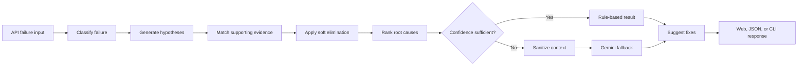

# API Medic

API Medic is a hybrid API-failure diagnostic application. It uses deterministic rules to classify failures, rank likely root causes, explain supporting and weakening evidence, and suggest fixes. When the rules cannot produce a sufficiently confident result, a LangGraph branch can invoke Gemini as an optional fallback.

## Live Demo

[Open API Medic](https://api-medic-93ky.onrender.com/)

[OpenAPI documentation](https://api-medic-93ky.onrender.com/docs)

The free Render instance may take about a minute to wake after a period of inactivity.

## Key Features

- Diagnoses authentication, authorization, validation, server, database, and database-concurrency failures.
- Uses weighted evidence matching and soft elimination to rank competing hypotheses.
- Routes low-confidence or unknown failures to an optional Gemini fallback.
- Redacts sensitive values before external LLM analysis.
- Accepts browser forms, structured text-file uploads, JSON API requests, and CLI input.
- Returns confidence-scored root causes, alternative causes, evidence, and actionable fixes.
- Provides typed request and response validation with FastAPI and Pydantic.
- Includes automated tests, static type checking, linting, Docker packaging, health checks, and GitHub Actions CI.

## Processing Flow



The deterministic route remains the default. Gemini is called only for an unknown category or when the strongest rule-based score is below the configured threshold.

## Technology

- Python 3.13
- FastAPI and Pydantic
- LangGraph
- Gemini through Google's OpenAI-compatible endpoint
- Jinja2 templates and CSS
- Pytest, Ruff, and mypy
- Docker
- GitHub Actions
- Render

## Run Locally

Clone the repository and enter it:

```bash
git clone https://github.com/ayuxharma/API-Medic.git
cd API-Medic
```

Create and activate a virtual environment:

```bash
python3 -m venv .venv
source .venv/bin/activate
```

Install the application dependencies:

```bash
python -m pip install -r requirements.txt
```

Create your local configuration:

```bash
cp .env.example .env
```

The rule-based application works without an API key. To enable the optional fallback, update `.env`:

```text
ENABLE_LLM_FALLBACK=true
GEMINI_API_KEY=your_gemini_api_key
GEMINI_MODEL=gemini-3.1-flash-lite
```

Never commit the `.env` file.

Start the web application:

```bash
python -m uvicorn web.main:app --reload
```

Then open [http://127.0.0.1:8000](http://127.0.0.1:8000).

## JSON API

Send a diagnosis request:

```bash
curl --request POST http://127.0.0.1:8000/api/diagnose \
  --header "Content-Type: application/json" \
  --data '{
    "endpoint": "/api/login",
    "method": "POST",
    "status_code": 401,
    "error_message": "JWT token expired",
    "stack_trace": ""
  }'
```

Interactive API documentation is available at [http://127.0.0.1:8000/docs](http://127.0.0.1:8000/docs).

## CLI

Analyze direct input:

```bash
python app.py \
  --endpoint /api/login \
  --method POST \
  --status 401 \
  --error "JWT token expired"
```

Analyze a structured sample file:

```bash
python app.py --file samples/auth_error.txt
```

## Quality Checks

Install development dependencies:

```bash
python -m pip install -r requirements-dev.txt
```

Run the complete verification suite:

```bash
pytest -v
ruff format --check .
ruff check .
mypy
```

GitHub Actions runs these checks automatically and also builds and smoke-tests the Docker image.

## Docker

Build the production image:

```bash
docker build -t api-medic .
```

Run it locally:

```bash
docker run --rm \
  --publish 8000:8000 \
  --env-file .env \
  api-medic
```

Check container health at [http://127.0.0.1:8000/health](http://127.0.0.1:8000/health).

## Project Structure

```text
agent/       Classification, reasoning, graph routing, redaction, and fixes
web/         FastAPI routes, schemas, and service layer
templates/   Browser UI templates
static/      Dark-theme CSS
samples/     Example structured failure inputs
tests/       Unit, integration, API, graph, security, and logging tests
app.py       Command-line entry point
Dockerfile   Production container definition
```

## Security Notes

- Submitted error data is treated as untrusted input.
- Known secret patterns are redacted before LLM analysis.
- Gemini output is validated before it can update the diagnosis.
- Provider failures preserve the deterministic result.
- API keys are supplied through environment variables rather than source code.

